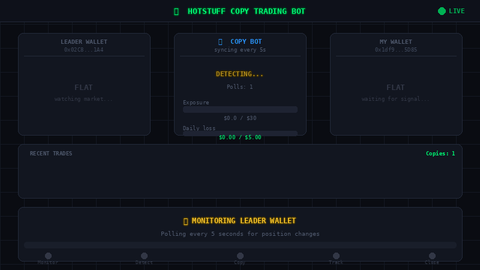

<div align="center">


<br/>

[](https://python.org)
[](https://app.hotstuff.trade/join/hot)
[](LICENSE)
[](https://github.com/omgmad/hotstuff-copy-trading-bot/stargazers)

<br/>

```
╔═══════════════════════════════════════════════════════════════╗
║  Leader opens SOL-PERP LONG  →  Your bot mirrors instantly   ║
║  Leader closes position      →  Your bot closes too    ✅    ║
╚═══════════════════════════════════════════════════════════════╝
```

**[🚀 Start Trading](https://app.hotstuff.trade/join/hot)** · **[📊 Find Top Traders](https://hotlytics.vercel.app/)** · **[🐦 Follow Dev](https://x.com/0mgm4d)**

</div>

---

## 📌 Table of Contents

- [How It Works](#-how-it-works)
- [Features](#-features)
- [Choosing Who to Copy](#-choosing-who-to-copy)
- [Installation](#-installation)
- [Configuration `.env`](#️-configuration-env)
- [Running the Bot](#-running-the-bot)
- [Running 24/7 on a VPS](#-running-247-on-a-vps)
- [Risk Management](#️-risk-management)
- [Telegram Commands](#-telegram-commands)
- [Disclaimer](#️-disclaimer)

---

## ⚡ How It Works

```
  Leader wallet ──► Opens SOL-PERP SHORT $500
          │
          ▼  (detected within 5 seconds)
          │
  Bot calculates position size:
  $500 × copy_ratio (0.5) = $250
  Your MAX_SOL = $30  →  capped at $30
          │
          ▼
  Your wallet ──► Opens SOL-PERP SHORT $30 ✅
          │
          ▼
  Leader closes position  →  Bot automatically closes too ✅
```
<div align="center">
  
</div>
The bot polls the leader's positions every 5 seconds. When a change is detected, it immediately places a proportionally scaled order on your account.

---

## 🎯 Features

| Feature | Description |
|--------|-------------|
| ⚡ **Real-time sync** | Polls leader positions every 5 seconds |
| 📐 **Auto sizing** | Scales trade size by copy ratio and max position limits |
| 🛡️ **Risk limits** | Daily loss limit, unrealized loss limit, max exposure cap |
| 📱 **Telegram alerts** | Trade notifications, errors, and remote control |
| 🔄 **Auto close** | Follows leader when they close — no manual action needed |
| 📊 **Live dashboard** | Real-time positions, PnL, and risk displayed in terminal |
| 🔁 **Auto-restart** | Recovers automatically from errors |
| 📝 **PnL history** | Every trade saved to `pnl_history.json` |

---

## 🏆 Choosing Who to Copy

> **⚠️ This is the most important step — copying the wrong trader will lose money.**

### [👉 Use Hotlytics Dashboard](https://hotlytics.vercel.app/)

Hotlytics shows the real-time performance of every trader on Hotstuff. Use it to find consistently profitable **manual traders**.

**✅ Good traders to copy:**
- Consistent long-term PnL (not just one lucky week)
- Holds positions for hours or days (swing trading)
- Makes 1–5 trades per day
- Clear directional bias — not constantly flipping sides

**❌ Do NOT copy these:**
- **HFT / High Frequency Traders** — trade dozens of times per second, your bot can't keep up and will lose on slippage
- **Market Makers** — hold positions on both sides simultaneously, copying this causes guaranteed loss
- **Scalpers** — hold positions for seconds or minutes, orders won't fill in time
- **Bot traders** — automated systems with patterns that don't copy well
- **Leverage manipulators** — constantly change leverage to distort position sizing

> 💡 **Tip:** Check a trader's history and look at how long they hold positions. Target traders who hold for 2+ hours on average.

---

## 🛠️ Installation

### Requirements

- Python 3.10+
- A [Hotstuff.trade](https://app.hotstuff.trade/join/hot) account
- An agent wallet (see below)
- At least $10 USDC deposited

### Step 1 — Clone the repository

```bash
git clone https://github.com/omgmad/hotstuff-copy-trading-bot
cd hotstuff-copy-trading-bot
```

### Step 2 — Create a virtual environment

```bash
python3 -m venv venv

# Linux / Mac
source venv/bin/activate

# Windows
venv\Scripts\activate
```

### Step 3 — Install dependencies

```bash
pip install requests msgpack eth-account eth-utils python-dotenv colorama
```

### Step 4 — Create an agent wallet

1. Go to [Hotstuff.trade](https://app.hotstuff.trade/join/hot)
2. Navigate to **Settings → Agents → Create Agent**
3. Save the agent **private key** and your main wallet **address**

> ⚠️ The agent private key is only used to sign orders. Your main wallet's private key is never needed.

---

## ⚙️ Configuration `.env`

Create a `.env` file in the project folder:

```env
# ── Your agent wallet (Hotstuff → Settings → Agents) ──
PRIVATE_KEY=0x_your_agent_private_key_here

# ── Your MAIN wallet address ───────────────────────────
# (NOT the agent address — the address shown in your dashboard)
WALLET_ADDRESS=0x_your_main_wallet_address_here

# ── The trader you want to copy (their MAIN wallet) ────
LEADER_ADDRESS=0x_leader_main_wallet_here

# ── Copy settings ──────────────────────────────────────
COPY_RATIO=0.5           # 0.5 = copy 50% of leader's size
SYMBOLS=SOL-PERP,HYPE-PERP  # Leave blank to follow all symbols

# ── Max position per symbol (USD) ──────────────────────
MAX_BTC=50
MAX_ETH=50
MAX_SOL=30
MAX_HYPE=30
MAX_TOTAL=100            # Total exposure cap across all symbols

# ── Risk limits ────────────────────────────────────────
DAILY_LOSS_LIMIT=10      # Bot halts if daily loss exceeds this ($)
UNREALIZED_LOSS_LIMIT=15 # Force-closes all positions if exceeded ($)

# ── Telegram (optional) ────────────────────────────────
TELEGRAM_TOKEN=
TELEGRAM_CHAT_ID=

# ── Sync interval ──────────────────────────────────────
SYNC_INTERVAL=5          # How often to check leader positions (seconds)
```

### Key distinction

```
WALLET_ADDRESS  = YOUR main wallet address  (not the agent!)
LEADER_ADDRESS  = the trader you are copying  (their main wallet)
PRIVATE_KEY     = YOUR agent's private key  (used for signing only)
```

---

## 🚀 Running the Bot

```bash
# First-time setup wizard
python hotstuff_copy_bot.py --setup

# Normal start
python hotstuff_copy_bot.py

# Dashboard only (no trading)
python hotstuff_copy_bot.py --dashboard
```

On successful start:

```
╔══════════════════════════════════════════════════════╗
║   🤖  Hotstuff Copy Trading Bot v1.3                 ║
║   Press Ctrl+C at any time to stop.                  ║
╚══════════════════════════════════════════════════════╝

  Leader:  0x02C84f1e9812c45A...
  Wallet:  0x5cca2c4D0f17A08...
  Ratio:   50%
  Symbols: SOL-PERP, HYPE-PERP

  Start bot? [yes/no]: yes
```

**Live terminal dashboard:**

```
🤖 Hotstuff Copy Bot v1.3                    updated 09:04:15
══════════════════════════════════════════════════════════════
  Status: ● RUNNING   API: OK   Ratio: 50%   Sync: 5s
  Leader: 0x02C84f1e9812c45A08...   Copies today: 3
──────────────────────────────────────────────────────────────
  POSITIONS
  Symbol         Mine      Leader   Side        Exposure   Max
  SOL-PERP    -0.1700    -1.3800   SHORT ▼    $  14.7   $  15
             [███████░] 98%
──────────────────────────────────────────────────────────────
  RISK
  Exposure   [████░░░░░░] $14.7 / $30
  Daily loss [░░░░░░░░░░] $0.00 / $10
  Unrealized  $+0.12  (limit: -$15)
──────────────────────────────────────────────────────────────
  RECENT TRADES
  09:04:15  SOL-PERP    SELL   $  15.0   fee $0.011
  08:42:50  SOL-PERP    SELL   $  15.0   fee $0.011
```

---

## 🖥️ Running 24/7 on a VPS

For continuous operation, use a cheap VPS (Vultr, DigitalOcean, Hetzner — ~$5/month).

### Ubuntu VPS setup

```bash
# 1. Update system
sudo apt update && sudo apt upgrade -y
sudo apt install python3 python3-pip python3-venv screen git -y

# 2. Clone repo
git clone https://github.com/omgmad/hotstuff-copy-trading-bot
cd hotstuff-copy-trading-bot

# 3. Virtual environment
python3 -m venv venv
source venv/bin/activate
pip install requests msgpack eth-account eth-utils python-dotenv colorama

# 4. Configure
nano .env   # paste your settings from above

# 5. Run inside screen (stays alive after you disconnect)
screen -S copybot
source venv/bin/activate
python hotstuff_copy_bot.py

# Press Ctrl+A then D to detach — bot keeps running
```

### Reconnect later

```bash
screen -r copybot
```

### Useful log commands

```bash
tail -50 copy_bot.log
grep "filled" copy_bot.log | tail -20        # Successful fills
grep "API response" copy_bot.log | tail -10  # Latest API responses
grep "OPEN\|CLOSE" copy_bot.log | tail -20   # All order attempts
```

---

## 🛡️ Risk Management

```
DAILY_LOSS_LIMIT hit      ──► Bot halts + closes all positions
UNREALIZED_LOSS_LIMIT hit ──► Immediately force-closes all (market order)
MAX_TOTAL exceeded         ──► Blocks all new positions
MAX_{SYMBOL} exceeded      ──► Blocks new positions for that symbol only
```

### Safe starter config (beginners)

```env
COPY_RATIO=0.3
MAX_SOL=15
MAX_HYPE=15
MAX_TOTAL=30
DAILY_LOSS_LIMIT=5
UNREALIZED_LOSS_LIMIT=8
```

> ⚠️ **Always start small.** Run the bot for a few hours with minimal capital before scaling up.

---

## 📱 Telegram Commands

If Telegram is configured, you can control the bot remotely from your phone:

| Command | Action |
|---------|--------|
| `/status` | Current positions, PnL, bot status |
| `/pause` | Pause copying (keeps existing positions open) |
| `/resume` | Resume copying |
| `/close` | Close all positions immediately (market order) |
| `/stop` | Stop the bot completely |
| `/pnl` | Detailed PnL breakdown |

### How to set up Telegram notifications

1. Message `@BotFather` on Telegram
2. Send `/newbot` and follow the steps to create a bot
3. Copy the **token** into `.env` as `TELEGRAM_TOKEN=`
4. Message `@userinfobot` to get your **Chat ID** → paste as `TELEGRAM_CHAT_ID=`

---

## ⚠️ Disclaimer

> **RISK WARNING:** This bot trades real money on mainnet. Copy trading carries significant financial risk. Past performance of any copied trader does not guarantee future results. You may lose some or all of your capital. Use entirely at your own risk.

- 🔴 Never invest more than you can afford to lose
- 🔴 Do not copy HFT, Market Maker, or scalper traders
- 🔴 Always test with a small amount before scaling up
- 🔴 Never share your `.env` file or private key with anyone
- 🔴 Secure your VPS — treat it like a wallet
- 🔴 Check your local regulations regarding automated trading

---

<div align="center">

## 🔗 Links

<a href="https://app.hotstuff.trade/join/hot">

</a>
&nbsp;
<a href="https://hotlytics.vercel.app/">

</a>
&nbsp;
<a href="https://x.com/0mgm4d">

</a>

<br/><br/>

**If this helped you, please give it a ⭐ Star — it means a lot!**


</div>
